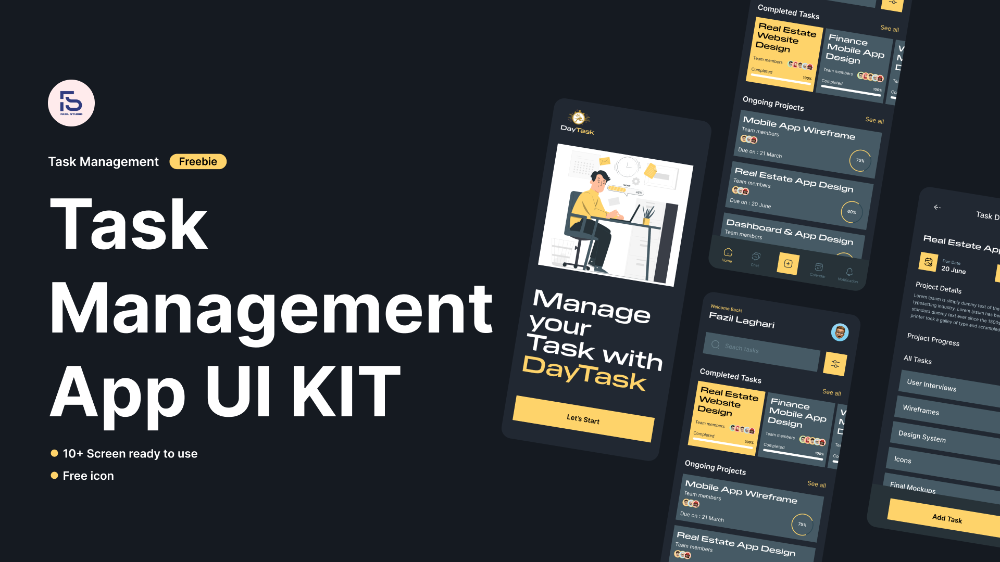

# To do list

A frontend Project Created with React, but initially used Vanilla JavaScript + Webpack.

## Goal

- Practise React Hooks
- Prop Validation
- Writing Clean Code
- Practise CRUD operations in React

## External Dependencies Used

- prop-types

### Running the App in VSCode

- Clone the repo
- Navigate to the project directory and on the terminal type 'npm install'
- After successfull installation, type 'npm run dev'.
- Navigate to the given directory

### Post

<blockquote class="twitter-tweet">
REACT ROUTING DISASTER.  I&#39;ve been working on revamping some projects I did a while back, among them a to do list. It was initially created with vanilla &amp; Webpack but decided to move it to react. I encountered new problems and I have never understood State Hook until I ...
&mdash; Samuel Njuguna (@Psammystprime1) <a href="https://twitter.com/Psammystprime1/status/1845463026041803096?ref_src=twsrc%5Etfw">October 13, 2024</a></blockquote> 
